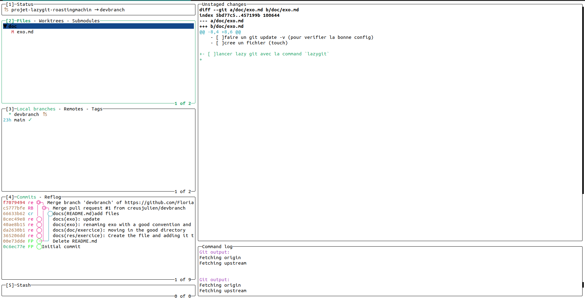

# 
utilisé lazygit 101

Pour faire l'exercice vous aurez besoin d'avoir installé lazygit. Voici un lien pour l'installer :
  

- [ ]les 4 étapes de création d'un repo
   - [ ]créer le repo github
   - [ ]clone le repo github en local
   - [ ]faire un git update -v (pour verifier la bonne config)
   - [ ]créer un fichier (touch)

- [ ]lancer lazy git avec la commande `lazygit`  
vous devriez avoir ceci dans le terminal

